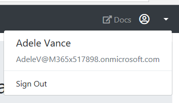

<!-- markdownlint-disable MD002 MD041 -->

In this exercise you will extend the application from the previous exercise to support authentication with Azure AD. This is required to obtain the necessary OAuth access token to call the Microsoft Graph. In this step you will integrate the [passport-azure-ad](https://github.com/AzureAD/passport-azure-ad) library into the application.

1. Create a new file named `.env` file in the root of your application, and add the following code.

    :::code language="ini" source="../demo/graph-tutorial/.env.example":::

    Replace `YOUR APP ID HERE` with the application ID from the Application Registration Portal, and replace `YOUR APP SECRET HERE` with the password you generated.

    > [!IMPORTANT]
    > If you're using source control such as git, now would be a good time to exclude the `.env` file from source control to avoid inadvertently leaking your app ID and password.

1. Open `./app.js` and add the following line to the top of the file to load the `.env` file.

    ```javascript
    require('dotenv').config();
    ```

## Implement sign-in

1. Locate the line `var indexRouter = require('./routes/index');` in `./app.js`. Insert the following code **before** that line.

    ```javascript
    var passport = require('passport');
    var OIDCStrategy = require('passport-azure-ad').OIDCStrategy;

    // Configure passport

    // In-memory storage of logged-in users
    // For demo purposes only, production apps should store
    // this in a reliable storage
    var users = {};

    // Passport calls serializeUser and deserializeUser to
    // manage users
    passport.serializeUser(function(user, done) {
      // Use the OID property of the user as a key
      users[user.profile.oid] = user;
      done (null, user.profile.oid);
    });

    passport.deserializeUser(function(id, done) {
      done(null, users[id]);
    });

    // Callback function called once the sign-in is complete
    // and an access token has been obtained
    async function signInComplete(iss, sub, profile, accessToken, refreshToken, params, done) {
      if (!profile.oid) {
        return done(new Error("No OID found in user profile."));
      }

      // Save the profile and tokens in user storage
      users[profile.oid] = { profile, accessToken };
      return done(null, users[profile.oid]);
    }

    // Configure OIDC strategy
    passport.use(new OIDCStrategy(
      {
        identityMetadata: `${process.env.OAUTH_AUTHORITY}${process.env.OAUTH_ID_METADATA}`,
        clientID: process.env.OAUTH_APP_ID,
        responseType: 'code id_token',
        responseMode: 'form_post',
        redirectUrl: process.env.OAUTH_REDIRECT_URI,
        allowHttpForRedirectUrl: true,
        clientSecret: process.env.OAUTH_APP_PASSWORD,
        validateIssuer: false,
        passReqToCallback: false,
        scope: process.env.OAUTH_SCOPES.split(' ')
      },
      signInComplete
    ));
    ```

    This code initializes the [Passport.js](http://www.passportjs.org/) library to use the `passport-azure-ad` library, and configures it with the app ID and password for the app.

1. Locate the line `app.use('/', indexRouter);` in `./app.js`. Insert the following code **before** that line.

    ```javascript
    // Initialize passport
    app.use(passport.initialize());
    app.use(passport.session());
    ```

1. Create a new file in the `./routes` directory named `auth.js` and add the following code.

    ```javascript
    var express = require('express');
    var passport = require('passport');
    var router = express.Router();

    /* GET auth callback. */
    router.get('/signin',
      function  (req, res, next) {
        passport.authenticate('azuread-openidconnect',
          {
            response: res,
            prompt: 'login',
            failureRedirect: '/',
            failureFlash: true,
            successRedirect: '/'
          }
        )(req,res,next);
      }
    );

    router.post('/callback',
      function(req, res, next) {
        passport.authenticate('azuread-openidconnect',
          {
            response: res,
            failureRedirect: '/',
            failureFlash: true
          }
        )(req,res,next);
      },
      function(req, res) {
        // TEMPORARY!
        // Flash the access token for testing purposes
        req.flash('error_msg', {message: 'Access token', debug: req.user.accessToken});
        res.redirect('/');
      }
    );

    router.get('/signout',
      function(req, res) {
        req.session.destroy(function(err) {
          req.logout();
          res.redirect('/');
        });
      }
    );

    module.exports = router;
    ```

    This defines a router with three routes: `signin`, `callback`, and `signout`.

    The `signin` route calls the `passport.authenticate` method, causing the app to redirect to the Azure login page.

    The `callback` route is where Azure redirects after the signin is complete. The code calls the `passport.authenticate` method again, causing the `passport-azure-ad` strategy to request an access token. Once the token is obtained, the next handler is called, which redirects back to the home page with the access token in the temporary error value. We'll use this to verify that our sign-in is working before moving on. Before we test, we need to configure the Express app to use the new router from `./routes/auth.js`.

    The `signout` method logs the user out and destroys the session.

1. Open `./app.js` and insert the following code **before** the `var app = express();` line.

    ```javascript
    var authRouter = require('./routes/auth');
    ```

1. Insert the following code **after** the `app.use('/', indexRouter);` line.

    ```javascript
    app.use('/auth', authRouter);
    ```

Start the server and browse to `https://localhost:3000`. Click the sign-in button and you should be redirected to `https://login.microsoftonline.com`. Login with your Microsoft account and consent to the requested permissions. The browser redirects to the app, showing the token.

### Get user details

1. Create a new file in the root of the project named `graph.js` and add the following code.

    ```javascript
    var graph = require('@microsoft/microsoft-graph-client');
    require('isomorphic-fetch');

    module.exports = {
      getUserDetails: async function(accessToken) {
        const client = getAuthenticatedClient(accessToken);

        const user = await client.api('/me').get();
        return user;
      }
    };

    function getAuthenticatedClient(accessToken) {
      // Initialize Graph client
      const client = graph.Client.init({
        // Use the provided access token to authenticate
        // requests
        authProvider: (done) => {
          done(null, accessToken);
        }
      });

      return client;
    }
    ```

    This exports the `getUserDetails` function, which uses the Microsoft Graph SDK to call the `/me` endpoint and return the result.

1. Open `/app.js` and add the following `require` statements to the top of the file.

    ```javascript
    var graph = require('./graph');
    ```

1. Replace the existing `signInComplete` function with the following code.

    ```javascript
    async function signInComplete(iss, sub, profile, accessToken, refreshToken, params, done) {
      if (!profile.oid) {
        return done(new Error("No OID found in user profile."));
      }

      try{
        const user = await graph.getUserDetails(accessToken);

        if (user) {
          // Add properties to profile
          profile['email'] = user.mail ? user.mail : user.userPrincipalName;
        }
      } catch (err) {
        return done(err);
      }

      // Save the profile and tokens in user storage
      users[profile.oid] = { profile, accessToken };
      return done(null, users[profile.oid]);
    }
    ```

    The new code updates the `profile` provided by Passport to add an `email` property, using the data returned by Microsoft Graph.

1. Add the following **after** the `app.use(passport.session());` line.

    :::code language="javascript" source="../demo/graph-tutorial/app.js" id="AddProfileSnippet":::

    This code loads the user profile into the `locals` property of the response. This will make it available to all of the views in the app.

## Storing the tokens

Now that you can get tokens, it's time to implement a way to store them in the app. Currently, the app is storing the raw access token in the in-memory user storage. Since this is a sample app, for simplicity's sake, you'll continue to store them there. A real-world app would use a more reliable secure storage solution, like a database.

However, storing just the access token doesn't allow you to check expiration or refresh the token. In order to enable that, update the sample to wrap the tokens in an `AccessToken` object from the `simple-oauth2` library.

1. Open `./app.js` and add the following code **before** the `signInComplete` function.

    :::code language="javascript" source="../demo/graph-tutorial/app.js" id="ConfigureOAuth2Snippet":::

1. Replace the existing `signInComplete` function with the following.

    :::code language="javascript" source="../demo/graph-tutorial/app.js" id="SignInCompleteSnippet" highlight="17-18, 21":::

1. Replace the existing callback route in  `./routes/auth.js` with the following.

    :::code language="javascript" source="../demo/graph-tutorial/routes/auth.js" id="CallbackRouteSnippet" highlight="17-18":::

1. Restart the server and go through the sign-in process. You should end up back on the home page, but the UI should change to indicate that you are signed-in.

    

1. Click the user avatar in the top right corner to access the **Sign Out** link. Clicking **Sign Out** resets the session and returns you to the home page.

    

## Refreshing tokens

At this point your application has an access token, which is sent in the `Authorization` header of API calls. This is the token that allows the app to access the Microsoft Graph on the user's behalf.

However, this token is short-lived. The token expires an hour after it is issued. This is where the refresh token becomes useful. The refresh token allows the app to request a new access token without requiring the user to sign in again.

1. Create a new file in the root of the project named `tokens.js` to hold token management functions. Add the following code.

    :::code language="javascript" source="../demo/graph-tutorial/tokens.js" id="TokensSnippet":::

This method first checks if the access token is expired or close to expiring. If it is, then it uses the refresh token to get new tokens, then updates the cache and returns the new access token. You'll use this method whenever you need to get the access token out of storage.
