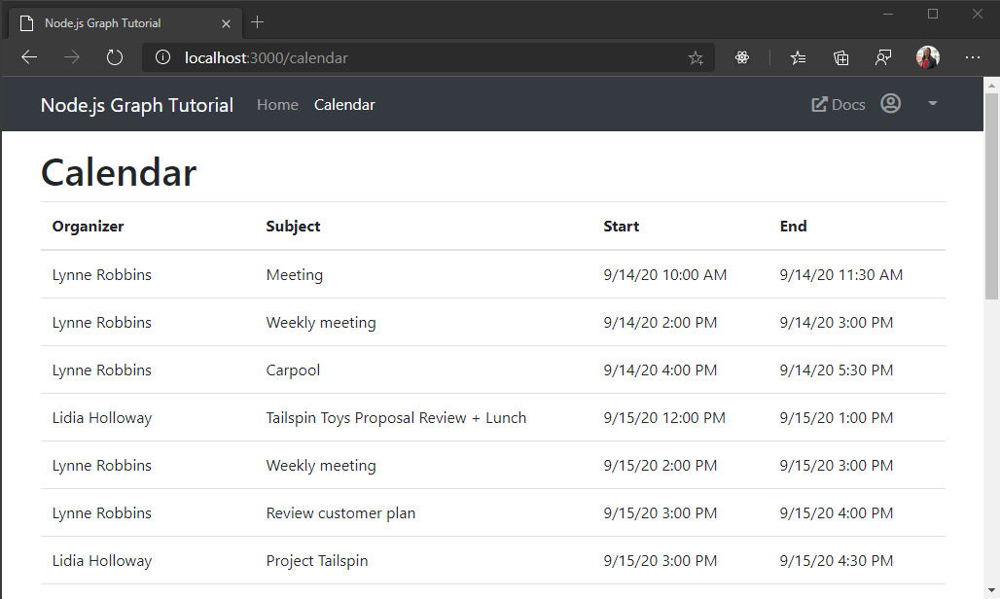

<!-- markdownlint-disable MD002 MD041 -->

In this exercise you will incorporate Microsoft Graph into the application. For this application, you will use the [microsoft-graph-client](https://github.com/microsoftgraph/msgraph-sdk-javascript) library to make calls to Microsoft Graph.

## Get calendar events from Outlook

1. Open `./graph.js` and add the following function inside `module.exports`.

    :::code language="javascript" source="../demo/graph-tutorial/graph.js" id="GetEventsSnippet":::

    Consider what this code is doing.

    - The URL that will be called is `/me/events`.
    - The `select` method limits the fields returned for each events to just those the view will actually use.
    - The `orderby` method sorts the results by the date and time they were created, with the most recent item being first.

1. Create a new file in the `./routes` directory named `calendar.js`, and add the following code.

    ```javascript
    var express = require('express');
    var router = express.Router();
    var tokens = require('../tokens.js');
    var graph = require('../graph.js');

    /* GET /calendar */
    router.get('/',
      async function(req, res) {
        if (!req.isAuthenticated()) {
          // Redirect unauthenticated requests to home page
          res.redirect('/')
        } else {
          let params = {
            active: { calendar: true }
          };

          // Get the access token
          var accessToken;
          try {
            accessToken = await tokens.getAccessToken(req);
          } catch (err) {
            res.json(err);
          }

          if (accessToken && accessToken.length > 0) {
            try {
              // Get the events
              var events = await graph.getEvents(accessToken);

              res.json(events.value);
            } catch (err) {
              res.json(err);
            }
          }
          else {
            req.flash('error_msg', 'Could not get an access token');
          }
        }
      }
    );

    module.exports = router;
    ```

1. Update `./app.js` to use this new route. Add the following line **before** the `var app = express();` line.

    ```javascript
    var calendarRouter = require('./routes/calendar');
    ```

1. Add the following line **after** the `app.use('/auth', authRouter);` line.

    ```javascript
    app.use('/calendar', calendarRouter);
    ```

1. Restart the server. Sign in and click the **Calendar** link in the nav bar. If everything works, you should see a JSON dump of events on the user's calendar.

## Display the results

Now you can add a view to display the results in a more user-friendly manner.

1. Add the following code in `./app.js` **after** the `app.set('view engine', 'hbs');` line.

    :::code language="javascript" source="../demo/graph-tutorial/app.js" id="FormatDateSnippet":::

    This implements a [Handlebars helper](http://handlebarsjs.com/#helpers) to format the ISO 8601 date returned by Microsoft Graph into something more human-friendly.

1. Create a new file in the `./views` directory named `calendar.hbs` and add the following code.

    :::code language="html" source="../demo/graph-tutorial/views/calendar.hbs" id="LayoutSnippet":::

    That will loop through a collection of events and add a table row for each one.

1. Now update the route in `./routes/calendar.js` to use this view. Replace the existing route with the following code.

    :::code language="javascript" source="../demo/graph-tutorial/routes/calendar.js" id="GetRouteSnippet" highlight="16-19,26,28-31,37":::

1. Save your changes, restart the server, and sign in to the app. Click on the **Calendar** link and the app should now render a table of events.

    
