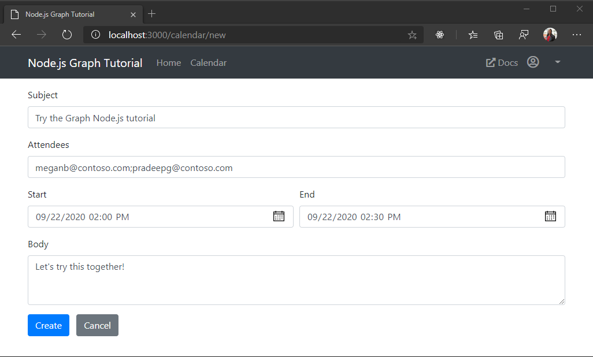

<!-- markdownlint-disable MD002 MD041 -->

In this section you will add the ability to create events on the user's calendar.

## Create a new event form

1. Create a new file in the **./views** directory named **newevent.hbs** and add the following code.

    :::code language="html" source="../demo/graph-tutorial/views/newevent.hbs" id="NewEventFormSnippet":::

1. Add the following code to the **./routes/calendar.js** file before the `module.exports = router;` line.

    :::code language="javascript" source="../demo/graph-tutorial/routes/calendar.js" id="GetEventFormSnippet":::

This implements a form for user input and renders it.

## Create the event

1. Open **./graph.js** and add the following function inside `module.exports`.

    :::code language="javascript" source="../demo/graph-tutorial/graph.js" id="CreateEventSnippet":::

    This code uses the form fields to create a Graph event object, then sends a POST request to the `/me/events` endpoint to create the event on the user's default calendar.

1. Add the following code to the **./routes/calendar.js** file before the `module.exports = router;` line.

    :::code language="javascript" source="../demo/graph-tutorial/routes/calendar.js" id="PostEventFormSnippet":::

    This code validates and sanitized the form input, then calls `graph.createEvent` to create the event. It redirects back to the calendar view after the call completes.

1. Save your changes and restart the app. Click the **Calendar** nav item, then click the **Create event** button. Fill in the values and click **Create**. The app returns to the calendar view once the new event is created.

    
