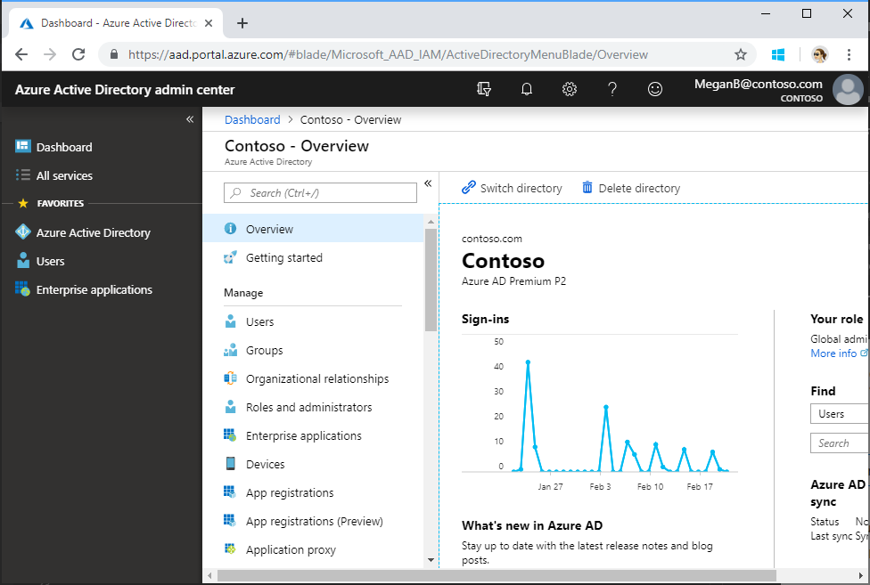
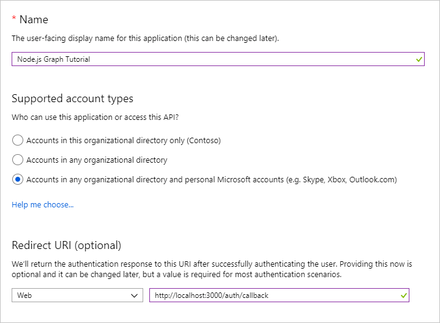
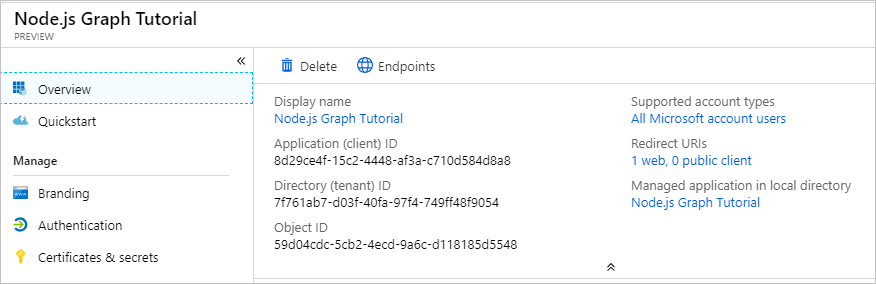
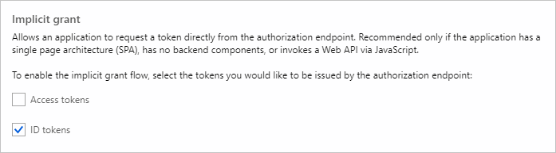
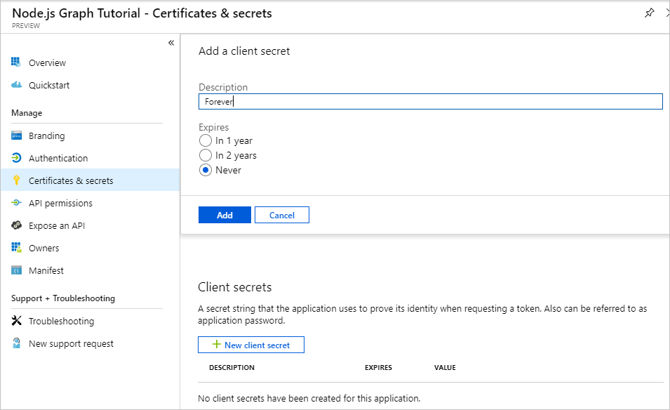
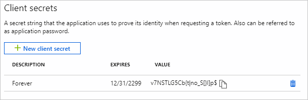

<!-- markdownlint-disable MD002 MD041 -->

In this exercise, you will create a new Azure AD web application registration using the Application Registry Portal (ARP).

1. Open a browser and navigate to the [Application Registration Portal](https://apps.dev.microsoft.com). Login using a **personal account** (aka: Microsoft Account) or **Work or School Account**.

1. Select **Add an app** at the top of the page.

    > [!NOTE]
    > If you see more than one **Add an app** button on the page, select the one that corresponds to the **Converged apps** list.

1. On the **Register your application** page, set the **Application Name** to **Node.js Graph Tutorial** and select **Create**.

    

1. On the **Node.js Graph Tutorial Registration** page, under the **Properties** section, copy the **Application Id** as you will need it later.

    

1. Scroll down to the **Application Secrets** section.

    1. Select **Generate New Password**.
    1. In the **New password generated** dialog, copy the contents of the box as you will need it later.

        > **Important:** This password is never shown again, so make sure you copy it now.

    

1. Scroll down to the **Platforms** section.

    1. Select **Add Platform**.
    1. In the **Add Platform** dialog, select **Web**.

        

    1. In the **Web** platform box, enter the URL `http://localhost:3000/auth/callback` for the **Redirect URLs**.

        

1. Scroll to the bottom of the page and select **Save**.

<!-- markdownlint-disable MD002 MD041 -->

In this exercise, you will create a new Azure AD web application registration using the Azure Active Directory admin center.

1. Open a browser and navigate to the [Azure Active Directory admin center](https://aad.portal.azure.com). Login using a **personal account** (aka: Microsoft Account) or **Work or School Account**.

1. Select **Azure Active Directory** in the left-hand navigation, then select **App registrations (Preview)** under **Manage**.

    

1. Select **New registration**. On the **Register an application** page, set the values as follows.

    - Set **Name** to `Node.js Graph Tutorial`.
    - Set **Supported account types** to **Accounts in any organizational directory and personal Microsoft accounts**.
    - Under **Redirect URI**, set the first drop-down to `Web` and set the value to `http://localhost:3000/auth/callback`.

    

1. Choose **Register**. On the **Node.js Graph Tutorial** page, copy the value of the **Application (client) ID** and save it, you will need it in the next step.

    

1. Select **Authentication** under **Manage**. Locate the **Implicit grant** section and enable **ID tokens**. Choose **Save**.

    

1. Select **Certificates & secrets** under **Manage**. Select the **New client secret** button. Enter a value in **Description** and select one of the options for **Expires** and choose **Add**.

    

1. Copy the client secret value before you leave this page. You will need it in the next step.

    > [!IMPORTANT]
    > This client secret is never shown again, so make sure you copy it now.

    