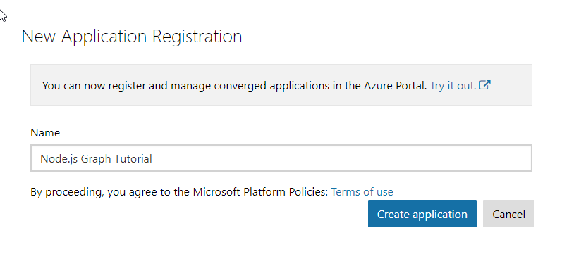
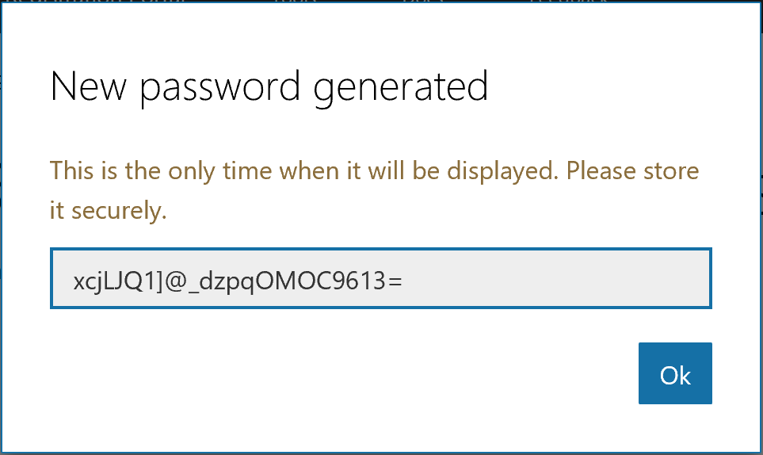
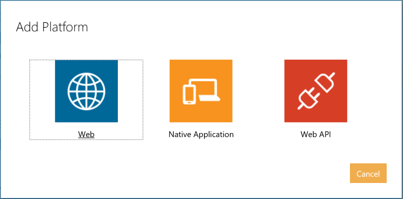

<!-- markdownlint-disable MD002 MD041 -->

In this exercise, you will create a new Azure AD web application registration using the Application Registry Portal (ARP).

1. Open a browser and navigate to the [Application Registration Portal](https://apps.dev.microsoft.com). Login using a **personal account** (aka: Microsoft Account) or **Work or School Account**.

1. Select **Add an app** at the top of the page.

    > [!NOTE]
    > If you see more than one **Add an app** button on the page, select the one that corresponds to the **Converged apps** list.

1. On the **Register your application** page, set the **Application Name** to **Node.js Graph Tutorial** and select **Create**.

    

1. On the **Node.js Graph Tutorial Registration** page, under the **Properties** section, copy the **Application Id** as you will need it later.

    

1. Scroll down to the **Application Secrets** section.

    1. Select **Generate New Password**.
    1. In the **New password generated** dialog, copy the contents of the box as you will need it later.

        > **Important:** This password is never shown again, so make sure you copy it now.

    

1. Scroll down to the **Platforms** section.

    1. Select **Add Platform**.
    1. In the **Add Platform** dialog, select **Web**.

        

    1. In the **Web** platform box, enter the URL `http://localhost:3000/auth/callback` for the **Redirect URLs**.

        

1. Scroll to the bottom of the page and select **Save**.